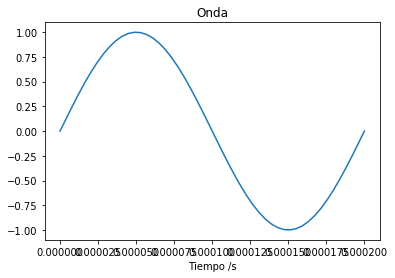
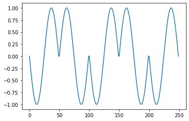
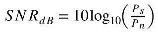

# Tarea4

## 1. Crear un esquema de modulación BPSK para los bits presentados. Esto implica asignar una forma de onda sinusoidal normalizada (amplitud unitaria) para cada bit y luego una concatenación de todas estas formas de onda.

Para esta parte comenzamos importando ciertas librerias que nos permitiran un manejo de datos mas eficiente y realizar todo lo que se pide. Tenemos una frecuencia de la portadora de 5000 Hz. El codigo usado  creamos el modelo BPSK en base que cuando se presenta un 1, la señal se define como la del seno positivo y si es un 0 seria el seno negativo.

Como resultado en esta parte, creamos la onda la cual es senoidal en base a la frecuencia que tenemos y tambien la onda modulda para cada bit de entrada asi como se ve en las siguiente imagenes. Debido a que se le da un numeero de muestreo por periodo de 50 puntos,la onda cambiara cada 50 dependiendo si es un 0 o un 1 en el bit que se lee. 

 


## 2. Calcular la potencia promedio de la señal modulada generada.

Para poder calcular la potencia pormedio primero se ncesita calcular potencia instantanea. Para la potencia promedio la definimos como la señal ya dada al cuadrado, la cual nos da la potencia intsntanea dada en cada particion de la señal dependiendo de los puntos que le demos. Mientras que para la potencia promedio usamos un metodo de integracion trapeziodal, asi con cada valor discreto hacemos la suma uno por uno de todos esos puntos encontrados en la potencia instatanea mediante su area. El codigo siguiente muestra como se hizo.


```python
#Parte 2

Pinst= senal**2

#Potencia Promedio (W)

P=integrate.trapz(Pinst, t)/(len(data)*T)

print('La potencio pormedio es:', P,'W' ) 
```
Al momento de evaluarlo dando como resultado lo siguiente.

```
La potencio promedio es: 0.4900009800019598 W
```

## 3. Simular un canal ruidoso del tipo AWGN (ruido aditivo blanco gaussiano) con una relación señal a ruido (SNR) desde -2 hasta 3 dB.

Se sabe que la relacion de ruido para una señal viene dada por .
Por  lo tanto se creo un codigo que mediante el SNR dado crere la modulacion a partir de la potencia del ruido creado, el cual se da despejando la formula anterior para Pn.  Se le saca la raiz a este valor y creamos el ruido. Debido a que tenemos 6 valores de SRN obtendremos distintas graficas moduladas para cada una como se mira acnontinuacion. Graficando cada 50 puntos ya que eso fue lo que se decidio como muestreo en el codigo.
Para SRN=-2
Para SRN=-1
Para SRN=0
Para SRN=1
Para SRN=2
Para SRN=3


