# Tarea4

## 1. Crear un esquema de modulación BPSK para los bits presentados. Esto implica asignar una forma de onda sinusoidal normalizada (amplitud unitaria) para cada bit y luego una concatenación de todas estas formas de onda.

Para esta parte comenzamos importando ciertas librerias que nos permitiran un manejo de datos mas eficiente y realizar todo lo que se pide. Tenemos una frecuencia de la portadora de 5000 Hz. El codigo usado  creamos el modelo BPSK en base que cuando se presenta un 1, la señal se define como la del seno positivo y si es un 0 seria el seno negativo.

Como resultado en esta parte, creamos la onda la cual es senoidal en base a la frecuencia que tenemos y tambien la onda modulda para cada bit de entrada asi como se ve en las siguiente imagenes. Debido a que se le da un numeero de muestreo por periodo de 50 puntos,la onda cambiara cada 50 dependiendo si es un 0 o un 1 en el bit que se lee. 

 


## 2. Calcular la potencia promedio de la señal modulada generada.

Para poder calcular la potencia pormedio primero se ncesita calcular potencia instantanea. Para la potencia promedio la definimos como la señal ya dada al cuadrado, la cual nos da la potencia intsntanea dada en cada particion de la señal dependiendo de los puntos que le demos. Mientras que para la potencia promedio usamos un metodo de integracion trapeziodal, asi con cada valor discreto hacemos la suma uno por uno de todos esos puntos encontrados en la potencia instatanea mediante su area. El codigo siguiente muestra como se hizo.


```python
#Parte 2

Pinst= senal**2

#Potencia Promedio (W)

P=integrate.trapz(Pinst, t)/(len(data)*T)

print('La potencio pormedio es:', P,'W' ) 
```
Al momento de evaluarlo dando como resultado lo siguiente.

```
La potencio promedio es: 0.4900009800019598 W
```

## 3. Simular un canal ruidoso del tipo AWGN (ruido aditivo blanco gaussiano) con una relación señal a ruido (SNR) desde -2 hasta 3 dB.

Se sabe que la relacion de ruido para una señal viene dada por .
Por  lo tanto se creo un codigo que mediante el SNR dado crere la modulacion a partir de la potencia del ruido creado, el cual se da despejando la formula anterior para Pn.  Se le saca la raiz a este valor y creamos el ruido. Debido a que tenemos 6 valores de SRN obtendremos distintas graficas moduladas para cada una como se mira a continuacion. Graficando cada 50 puntos ya que eso fue lo que se decidio como muestreo en el codigo desde un SRN de -2 a 3.


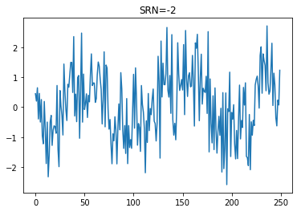 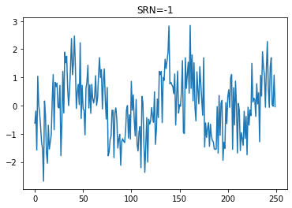 

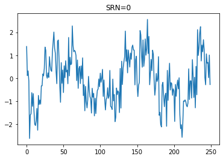 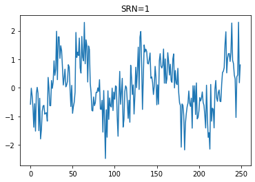 

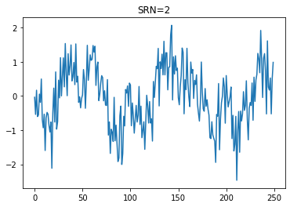 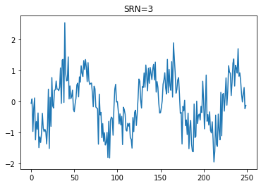

## 4. Graficar la densidad espectral de potencia de la señal con el método de Welch (SciPy), antes y después del canal ruidoso.

Para esta parte se necesita el metodo de Welch, ppor lo que utuilzamos este metodo encontrado en la biblioteca scipy. Este nos ayuda a calcular una estimacion de la densidad espectral de la potencia en segmentos, creando asi un periodograma. Al utilizarla se le dan como argumentos la señal. la frecuencia de muestreo, y la longitud que queremos en cada segmento. Se obtienen 12 diferentes resultados para antes y despues de pasarlo por el ruido. Se puede ver que la densidad llega a modificarse un poco en cada SNR.

Para SNR=-2

 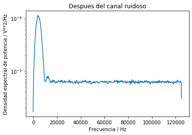 

Para SNR=-1

 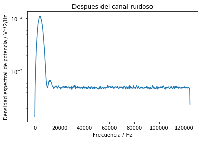 

Para SNR=0

 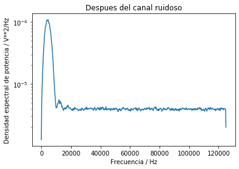 

Para SNR=1

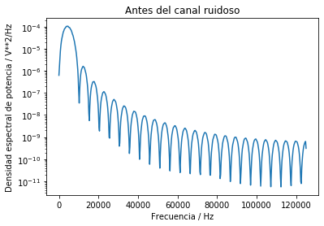 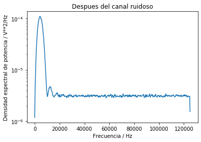 

Para SNR=2

 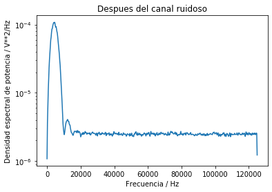 

Para SNR=3

 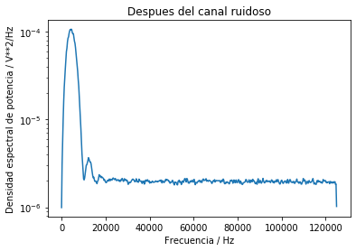 

## 5. Demodular y decodificar la señal y hacer un conteo de la tasa de error de bits (BER, bit error rate) para cada nivel SNR.

Para poder se definen los parametros de pseudo energia de la onda original. Para asi comparar la pseudo energia de la señal ruidosa encontrada para cada SNR dividida a la mitad para asi tener un porcentaje igualitario para ambos resultados de ser 0 o 1. Para asi saber y asignar a uun nuevo vector de que si se encontro energia asigne el valor a uno y si no a 0 encontrando el producto interno de dos funciones. 
Para encontrar la cantidad de errores hacemos la resta de bits entre los nuevos encontrados para ver si hay errores dentro de un valor absoluto para saber la cantidad de errores.
Por lo tanto un ejemplo de los resultados puede ser el siguiente ya que varia a veces debido a la variacion de pseudo energia y la asignacion de 1 y 0. Encontrando los valores desde SRN -2 a 3 ademas se ve que dan valores aceptables ya que son muy bajos.

```
Hay un total de 15.0 errores en 10000 bits para una tasa de error de 0.0015.
Hay un total de 4.0 errores en 10000 bits para una tasa de error de 0.0004.
Hay un total de 1.0 errores en 10000 bits para una tasa de error de 0.0001.
Hay un total de 0.0 errores en 10000 bits para una tasa de error de 0.0.
Hay un total de 0.0 errores en 10000 bits para una tasa de error de 0.0.
Hay un total de 0.0 errores en 10000 bits para una tasa de error de 0.0.
```


## 6. Graficar BER versus SNR.

Aqui podemos ver dependiendo del SNR que la cantidad de errores disminuye mientras mas grande sea debido a que mientras mas grande el SNR menos es el ruido.

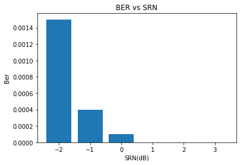 


